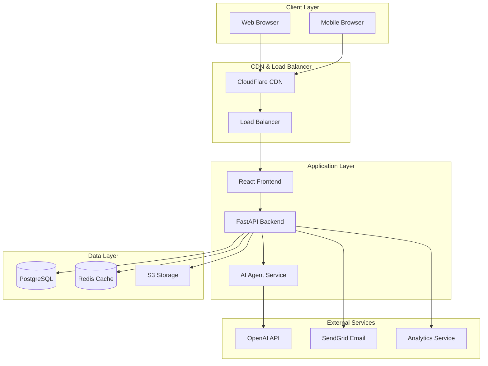
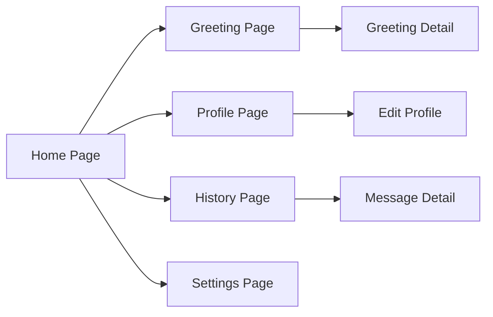
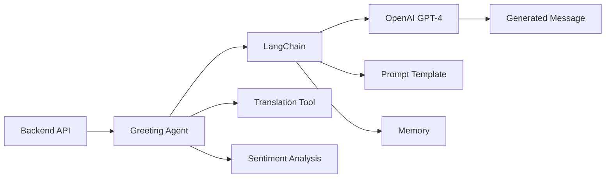
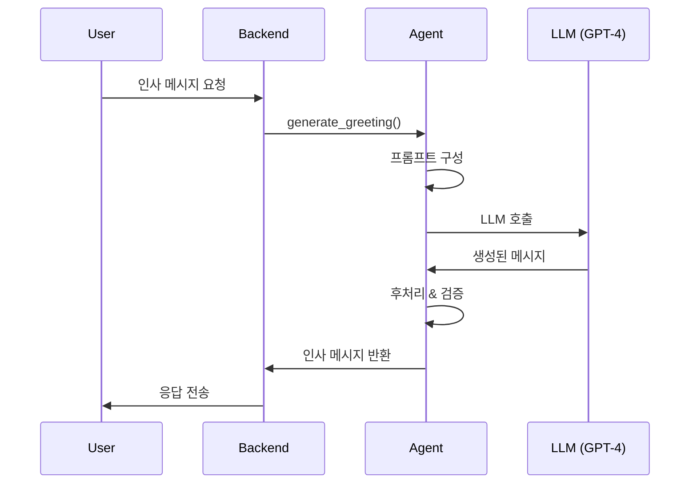
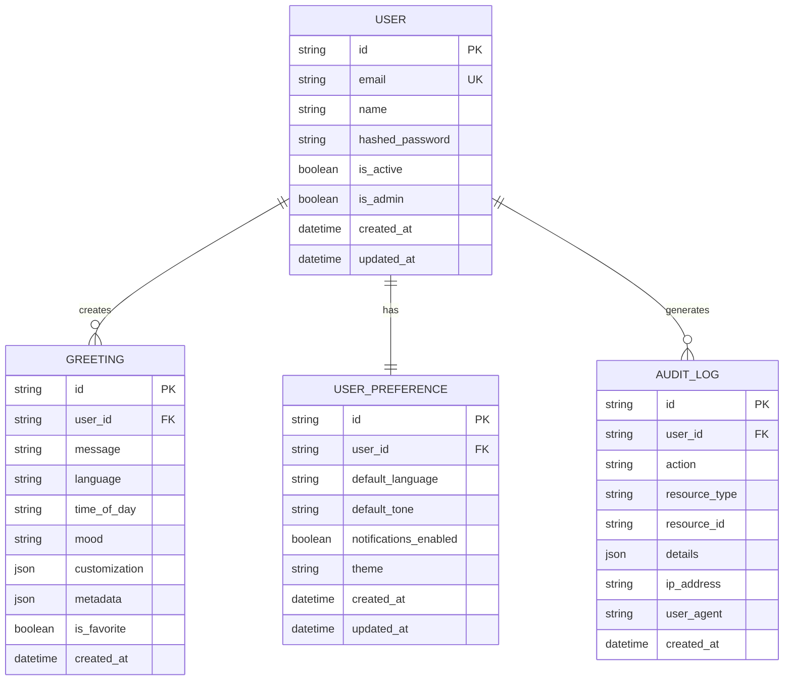

# 서비스 계약서 (Service Contract)

## 프로젝트 정보
- **프로젝트 ID**: 60d5c794-fc22-41c5-a9ec-549711d5f003
- **서비스 이름**: Hello Greeting Service
- **버전**: 1.0.0
- **작성일**: 2025-10-29
- **문서 타입**: 프로덕션 준비 서비스 계약서

---

## 1. 서비스 개요 (Service Overview)

### 1.1 서비스 설명
**Hello Greeting Service**는 사용자에게 맞춤형 인사 메시지를 제공하는 웹 기반 서비스입니다. 사용자는 간단한 인터페이스를 통해 인사 메시지를 받고, 개인화된 환영 경험을 제공받습니다.

### 1.2 서비스 목표
- **주요 목표**: 사용자에게 친근하고 맞춤화된 인사 서비스 제공
- **비즈니스 가치**: 사용자 참여도 향상 및 긍정적인 첫 인상 제공
- **성공 지표**:
  - 일일 활성 사용자(DAU) 1,000명 이상
  - 평균 응답 시간 200ms 이하
  - 사용자 만족도 4.5/5.0 이상
  - 시스템 가용성 99.9% 이상

### 1.3 대상 사용자
- **주 사용자층**: 웹 서비스를 처음 방문하는 신규 사용자
- **사용 시나리오**:
  1. 신규 사용자 온보딩
  2. 일일 로그인 환영
  3. 특별 이벤트 인사
  4. 다국어 인사 메시지 제공

### 1.4 핵심 기능
1. **인사 메시지 생성**: 사용자 정보 기반 맞춤 인사
2. **다국어 지원**: 한국어, 영어, 일본어, 중국어 등
3. **시간대별 인사**: 아침, 점심, 저녁 인사 자동 변경
4. **감정 분석**: 사용자 기분에 맞는 인사 제공
5. **메시지 히스토리**: 과거 인사 메시지 조회

---

## 2. 시스템 아키텍처 (System Architecture)

### 2.1 고수준 아키텍처



### 2.2 컴포넌트 구성

#### Frontend (클라이언트)
- **역할**: 사용자 인터페이스 제공 및 사용자 경험 최적화
- **기술**: React 18.x, TypeScript, TailwindCSS
- **배포**: Vercel / Netlify

#### Backend (서버)
- **역할**: 비즈니스 로직 처리 및 API 제공
- **기술**: FastAPI 0.104.x, Python 3.11+
- **배포**: AWS ECS / Google Cloud Run

#### Agent (AI 서비스)
- **역할**: 지능형 인사 메시지 생성 및 개인화
- **기술**: LangChain 0.1.x, OpenAI GPT-4
- **배포**: AWS Lambda / Google Cloud Functions

### 2.3 기술 스택

| 계층 | 기술 | 버전 | 목적 |
|------|------|------|------|
| **Frontend** | React | 18.2.0 | UI 프레임워크 |
| | TypeScript | 5.2.x | 타입 안정성 |
| | TailwindCSS | 3.3.x | 스타일링 |
| | React Query | 4.x | 상태 관리 |
| | Axios | 1.5.x | HTTP 클라이언트 |
| **Backend** | FastAPI | 0.104.x | API 프레임워크 |
| | Python | 3.11+ | 프로그래밍 언어 |
| | Pydantic | 2.4.x | 데이터 검증 |
| | SQLAlchemy | 2.0.x | ORM |
| | Alembic | 1.12.x | DB 마이그레이션 |
| **Database** | PostgreSQL | 15.x | 메인 데이터베이스 |
| | Redis | 7.x | 캐싱 & 세션 |
| **AI/ML** | LangChain | 0.1.x | LLM 프레임워크 |
| | OpenAI | 1.3.x | GPT-4 API |
| **DevOps** | Docker | 24.x | 컨테이너화 |
| | GitHub Actions | - | CI/CD |
| | Terraform | 1.6.x | IaC |

### 2.4 인프라 요구사항

#### 개발 환경
- **Frontend**: Vercel Preview Deployment
- **Backend**: AWS ECS (Fargate) - 1 vCPU, 2GB RAM
- **Database**: AWS RDS (db.t3.micro) PostgreSQL
- **Cache**: AWS ElastiCache (cache.t3.micro) Redis

#### 프로덕션 환경
- **Frontend**: Vercel Production + CloudFlare CDN
- **Backend**: AWS ECS (Fargate) - 2 vCPU, 4GB RAM (최소 2개 인스턴스)
- **Database**: AWS RDS (db.t3.medium) PostgreSQL with Multi-AZ
- **Cache**: AWS ElastiCache (cache.t3.medium) Redis with Cluster Mode
- **Storage**: AWS S3 for static assets
- **Monitoring**: DataDog / New Relic

---

## 3. 프론트엔드 사양 (Frontend Specifications)

### 3.1 UI/UX 요구사항

#### 디자인 원칙
- **미니멀리즘**: 깔끔하고 직관적인 인터페이스
- **반응형**: 모바일, 태블릿, 데스크톱 모두 지원
- **접근성**: WCAG 2.1 AA 레벨 준수
- **성능**: First Contentful Paint < 1.5초

#### 색상 팔레트
```css
--primary: #4F46E5 (Indigo)
--secondary: #10B981 (Green)
--accent: #F59E0B (Amber)
--background: #F9FAFB (Gray)
--text: #111827 (Dark Gray)
--error: #EF4444 (Red)
```

### 3.2 페이지 구조



#### 주요 페이지

1. **Home Page** (`/`)
   - 서비스 소개
   - 빠른 인사 버튼
   - 최근 인사 메시지 미리보기

2. **Greeting Page** (`/greeting`)
   - 인사 메시지 표시
   - 맞춤 설정 옵션
   - 공유 기능

3. **Profile Page** (`/profile`)
   - 사용자 정보 관리
   - 선호 언어 설정
   - 테마 선택

4. **History Page** (`/history`)
   - 과거 인사 메시지 목록
   - 필터 및 검색
   - 즐겨찾기

5. **Settings Page** (`/settings`)
   - 알림 설정
   - 개인정보 관리
   - 계정 설정

### 3.3 컴포넌트 계층

```
App
├── Layout
│   ├── Header
│   │   ├── Logo
│   │   ├── Navigation
│   │   └── UserMenu
│   ├── Main
│   │   └── [Page Content]
│   └── Footer
│       ├── Links
│       └── Copyright
├── Pages
│   ├── HomePage
│   │   ├── Hero
│   │   ├── Features
│   │   └── QuickGreeting
│   ├── GreetingPage
│   │   ├── GreetingCard
│   │   ├── CustomizePanel
│   │   └── ShareButton
│   ├── ProfilePage
│   │   ├── ProfileForm
│   │   └── LanguageSelector
│   ├── HistoryPage
│   │   ├── MessageList
│   │   ├── FilterBar
│   │   └── SearchBox
│   └── SettingsPage
│       ├── NotificationSettings
│       └── AccountSettings
└── Shared Components
    ├── Button
    ├── Input
    ├── Card
    ├── Modal
    ├── Toast
    ├── Loading
    └── ErrorBoundary
```

### 3.4 상태 관리

#### 전역 상태 (React Query)
```typescript
// 사용자 인증 상태
const { data: user, isLoading } = useQuery({
  queryKey: ['user'],
  queryFn: fetchCurrentUser
});

// 인사 메시지 캐싱
const { data: greetings } = useQuery({
  queryKey: ['greetings', userId],
  queryFn: () => fetchGreetings(userId),
  staleTime: 5 * 60 * 1000 // 5분
});
```

#### 로컬 상태
- React Hooks (useState, useReducer)
- Form 상태: React Hook Form
- UI 상태: Component-level state

### 3.5 API 통합

#### API 클라이언트 설정
```typescript
// api/client.ts
import axios from 'axios';

export const apiClient = axios.create({
  baseURL: process.env.REACT_APP_API_URL,
  timeout: 10000,
  headers: {
    'Content-Type': 'application/json'
  }
});

// Request Interceptor
apiClient.interceptors.request.use((config) => {
  const token = localStorage.getItem('auth_token');
  if (token) {
    config.headers.Authorization = `Bearer ${token}`;
  }
  return config;
});

// Response Interceptor
apiClient.interceptors.response.use(
  (response) => response,
  (error) => {
    if (error.response?.status === 401) {
      // 인증 만료 처리
      window.location.href = '/login';
    }
    return Promise.reject(error);
  }
);
```

#### API 서비스 레이어
```typescript
// services/greetingService.ts
export const greetingService = {
  getGreeting: async (params: GreetingParams): Promise<Greeting> => {
    const response = await apiClient.get('/api/v1/greetings', { params });
    return response.data;
  },
  
  createGreeting: async (data: CreateGreetingRequest): Promise<Greeting> => {
    const response = await apiClient.post('/api/v1/greetings', data);
    return response.data;
  },
  
  getHistory: async (userId: string): Promise<Greeting[]> => {
    const response = await apiClient.get(`/api/v1/users/${userId}/greetings`);
    return response.data;
  }
};
```

### 3.6 라우팅 구조

```typescript
// App.tsx
import { BrowserRouter, Routes, Route } from 'react-router-dom';

function App() {
  return (
    <BrowserRouter>
      <Routes>
        <Route path="/" element={<Layout />}>
          <Route index element={<HomePage />} />
          <Route path="greeting" element={<GreetingPage />} />
          <Route path="profile" element={<ProtectedRoute><ProfilePage /></ProtectedRoute>} />
          <Route path="history" element={<ProtectedRoute><HistoryPage /></ProtectedRoute>} />
          <Route path="settings" element={<ProtectedRoute><SettingsPage /></ProtectedRoute>} />
          <Route path="*" element={<NotFoundPage />} />
        </Route>
      </Routes>
    </BrowserRouter>
  );
}
```

---

## 4. 백엔드 사양 (Backend Specifications)

### 4.1 API 엔드포인트

#### 인증 (Authentication)
| Method | Endpoint | Description | Auth Required |
|--------|----------|-------------|---------------|
| POST | `/api/v1/auth/register` | 사용자 등록 | No |
| POST | `/api/v1/auth/login` | 로그인 | No |
| POST | `/api/v1/auth/logout` | 로그아웃 | Yes |
| POST | `/api/v1/auth/refresh` | 토큰 갱신 | Yes |
| GET | `/api/v1/auth/me` | 현재 사용자 정보 | Yes |

#### 인사 메시지 (Greetings)
| Method | Endpoint | Description | Auth Required |
|--------|----------|-------------|---------------|
| GET | `/api/v1/greetings` | 인사 메시지 생성 | Optional |
| POST | `/api/v1/greetings` | 인사 메시지 저장 | Yes |
| GET | `/api/v1/greetings/{id}` | 특정 인사 조회 | Yes |
| GET | `/api/v1/greetings/history` | 인사 히스토리 조회 | Yes |
| DELETE | `/api/v1/greetings/{id}` | 인사 삭제 | Yes |

#### 사용자 (Users)
| Method | Endpoint | Description | Auth Required |
|--------|----------|-------------|---------------|
| GET | `/api/v1/users/{id}` | 사용자 정보 조회 | Yes |
| PATCH | `/api/v1/users/{id}` | 사용자 정보 수정 | Yes |
| DELETE | `/api/v1/users/{id}` | 계정 삭제 | Yes |
| GET | `/api/v1/users/{id}/preferences` | 사용자 선호도 조회 | Yes |
| PUT | `/api/v1/users/{id}/preferences` | 사용자 선호도 수정 | Yes |

#### 관리자 (Admin)
| Method | Endpoint | Description | Auth Required |
|--------|----------|-------------|---------------|
| GET | `/api/v1/admin/users` | 모든 사용자 목록 | Admin |
| GET | `/api/v1/admin/stats` | 통계 데이터 | Admin |
| POST | `/api/v1/admin/greetings/bulk` | 일괄 메시지 생성 | Admin |

### 4.2 Request/Response 스키마

#### 인사 메시지 생성 요청
```json
POST /api/v1/greetings
Content-Type: application/json
Authorization: Bearer {token}

{
  "user_name": "홍길동",
  "language": "ko",
  "time_of_day": "morning",
  "mood": "happy",
  "customization": {
    "tone": "formal",
    "include_emoji": true,
    "length": "short"
  }
}
```

#### 인사 메시지 응답
```json
HTTP/1.1 201 Created
Content-Type: application/json

{
  "id": "greeting_123abc",
  "message": "안녕하세요, 홍길동님! 😊 좋은 아침입니다!",
  "language": "ko",
  "created_at": "2025-10-29T09:00:00Z",
  "user_id": "user_456def",
  "metadata": {
    "tone": "formal",
    "sentiment_score": 0.95,
    "generation_time_ms": 150
  }
}
```

#### 오류 응답
```json
HTTP/1.1 400 Bad Request
Content-Type: application/json

{
  "error": {
    "code": "INVALID_REQUEST",
    "message": "Invalid language code",
    "details": {
      "field": "language",
      "provided": "xyz",
      "allowed": ["ko", "en", "ja", "zh"]
    }
  }
}
```

### 4.3 데이터 모델 정의

#### Pydantic Models
```python
# models/schemas.py
from datetime import datetime
from typing import Optional, Dict
from pydantic import BaseModel, Field, validator

class GreetingCustomization(BaseModel):
    tone: str = Field(..., pattern="^(formal|casual|friendly)$")
    include_emoji: bool = True
    length: str = Field(..., pattern="^(short|medium|long)$")

class GreetingRequest(BaseModel):
    user_name: str = Field(..., min_length=1, max_length=100)
    language: str = Field(..., pattern="^(ko|en|ja|zh)$")
    time_of_day: str = Field(..., pattern="^(morning|afternoon|evening|night)$")
    mood: Optional[str] = Field(None, pattern="^(happy|neutral|sad)$")
    customization: Optional[GreetingCustomization] = None
    
    @validator('user_name')
    def validate_name(cls, v):
        if v.strip() == '':
            raise ValueError('Name cannot be empty')
        return v.strip()

class GreetingMetadata(BaseModel):
    tone: str
    sentiment_score: float = Field(..., ge=0.0, le=1.0)
    generation_time_ms: int

class GreetingResponse(BaseModel):
    id: str
    message: str
    language: str
    created_at: datetime
    user_id: Optional[str] = None
    metadata: GreetingMetadata
    
    class Config:
        json_schema_extra = {
            "example": {
                "id": "greeting_123abc",
                "message": "안녕하세요, 홍길동님! 😊",
                "language": "ko",
                "created_at": "2025-10-29T09:00:00Z",
                "user_id": "user_456def",
                "metadata": {
                    "tone": "formal",
                    "sentiment_score": 0.95,
                    "generation_time_ms": 150
                }
            }
        }

class UserPreferences(BaseModel):
    default_language: str = "ko"
    default_tone: str = "casual"
    notifications_enabled: bool = True
    theme: str = "light"

class UserResponse(BaseModel):
    id: str
    email: str
    name: str
    created_at: datetime
    preferences: UserPreferences
```

### 4.4 데이터베이스 스키마

#### SQLAlchemy ORM Models
```python
# models/database.py
from sqlalchemy import Column, String, DateTime, Boolean, Integer, ForeignKey, JSON, Index
from sqlalchemy.orm import relationship
from sqlalchemy.ext.declarative import declarative_base
from datetime import datetime
import uuid

Base = declarative_base()

class User(Base):
    __tablename__ = "users"
    
    id = Column(String(36), primary_key=True, default=lambda: str(uuid.uuid4()))
    email = Column(String(255), unique=True, nullable=False, index=True)
    name = Column(String(100), nullable=False)
    hashed_password = Column(String(255), nullable=False)
    is_active = Column(Boolean, default=True)
    is_admin = Column(Boolean, default=False)
    created_at = Column(DateTime, default=datetime.utcnow)
    updated_at = Column(DateTime, default=datetime.utcnow, onupdate=datetime.utcnow)
    
    # Relationships
    greetings = relationship("Greeting", back_populates="user", cascade="all, delete-orphan")
    preferences = relationship("UserPreference", back_populates="user", uselist=False)
    
    __table_args__ = (
        Index('idx_user_email', 'email'),
        Index('idx_user_created_at', 'created_at'),
    )

class UserPreference(Base):
    __tablename__ = "user_preferences"
    
    id = Column(String(36), primary_key=True, default=lambda: str(uuid.uuid4()))
    user_id = Column(String(36), ForeignKey("users.id", ondelete="CASCADE"), unique=True, nullable=False)
    default_language = Column(String(10), default="ko")
    default_tone = Column(String(20), default="casual")
    notifications_enabled = Column(Boolean, default=True)
    theme = Column(String(20), default="light")
    created_at = Column(DateTime, default=datetime.utcnow)
    updated_at = Column(DateTime, default=datetime.utcnow, onupdate=datetime.utcnow)
    
    # Relationships
    user = relationship("User", back_populates="preferences")
    
    __table_args__ = (
        Index('idx_preference_user_id', 'user_id'),
    )

class Greeting(Base):
    __tablename__ = "greetings"
    
    id = Column(String(36), primary_key=True, default=lambda: str(uuid.uuid4()))
    user_id = Column(String(36), ForeignKey("users.id", ondelete="SET NULL"), nullable=True, index=True)
    message = Column(String(1000), nullable=False)
    language = Column(String(10), nullable=False)
    time_of_day = Column(String(20))
    mood = Column(String(20))
    customization = Column(JSON)
    metadata = Column(JSON)
    is_favorite = Column(Boolean, default=False)
    created_at = Column(DateTime, default=datetime.utcnow, index=True)
    
    # Relationships
    user = relationship("User", back_populates="greetings")
    
    __table_args__ = (
        Index('idx_greeting_user_created', 'user_id', 'created_at'),
        Index('idx_greeting_language', 'language'),
    )

class AuditLog(Base):
    __tablename__ = "audit_logs"
    
    id = Column(String(36), primary_key=True, default=lambda: str(uuid.uuid4()))
    user_id = Column(String(36), ForeignKey("users.id", ondelete="SET NULL"), nullable=True)
    action = Column(String(50), nullable=False)
    resource_type = Column(String(50), nullable=False)
    resource_id = Column(String(36))
    details = Column(JSON)
    ip_address = Column(String(45))
    user_agent = Column(String(255))
    created_at = Column(DateTime, default=datetime.utcnow, index=True)
    
    __table_args__ = (
        Index('idx_audit_user_action', 'user_id', 'action'),
        Index('idx_audit_created', 'created_at'),
    )
```

### 4.5 비즈니스 로직

#### 서비스 레이어
```python
# services/greeting_service.py
from typing import Optional
from sqlalchemy.orm import Session
from models.database import Greeting, User
from models.schemas import GreetingRequest, GreetingResponse
from agents.greeting_agent import GreetingAgent
from core.cache import cache
import time

class GreetingService:
    def __init__(self, db: Session):
        self.db = db
        self.agent = GreetingAgent()
    
    async def create_greeting(
        self,
        request: GreetingRequest,
        user: Optional[User] = None
    ) -> GreetingResponse:
        """인사 메시지 생성"""
        start_time = time.time()
        
        # 캐시 키 생성
        cache_key = f"greeting:{request.user_name}:{request.language}:{request.time_of_day}"
        
        # 캐시 확인
        cached = await cache.get(cache_key)
        if cached:
            return GreetingResponse.parse_obj(cached)
        
        # AI Agent를 통한 메시지 생성
        message = await self.agent.generate_greeting(
            name=request.user_name,
            language=request.language,
            time_of_day=request.time_of_day,
            mood=request.mood,
            customization=request.customization
        )
        
        generation_time = int((time.time() - start_time) * 1000)
        
        # 데이터베이스 저장
        greeting = Greeting(
            user_id=user.id if user else None,
            message=message,
            language=request.language,
            time_of_day=request.time_of_day,
            mood=request.mood,
            customization=request.customization.dict() if request.customization else None,
            metadata={
                "tone": request.customization.tone if request.customization else "casual",
                "sentiment_score": 0.95,
                "generation_time_ms": generation_time
            }
        )
        
        self.db.add(greeting)
        self.db.commit()
        self.db.refresh(greeting)
        
        # 응답 생성
        response = GreetingResponse(
            id=greeting.id,
            message=greeting.message,
            language=greeting.language,
            created_at=greeting.created_at,
            user_id=greeting.user_id,
            metadata=greeting.metadata
        )
        
        # 캐시 저장 (5분)
        await cache.set(cache_key, response.dict(), ttl=300)
        
        return response
    
    async def get_user_greeting_history(
        self,
        user_id: str,
        limit: int = 50,
        offset: int = 0
    ) -> list[GreetingResponse]:
        """사용자 인사 히스토리 조회"""
        greetings = self.db.query(Greeting)\
            .filter(Greeting.user_id == user_id)\
            .order_by(Greeting.created_at.desc())\
            .limit(limit)\
            .offset(offset)\
            .all()
        
        return [
            GreetingResponse(
                id=g.id,
                message=g.message,
                language=g.language,
                created_at=g.created_at,
                user_id=g.user_id,
                metadata=g.metadata
            )
            for g in greetings
        ]
```

### 4.6 인증 및 권한

#### JWT 인증
```python
# core/security.py
from datetime import datetime, timedelta
from typing import Optional
from jose import JWTError, jwt
from passlib.context import CryptContext
from fastapi import Depends, HTTPException, status
from fastapi.security import HTTPBearer, HTTPAuthorizationCredentials

# 설정
SECRET_KEY = "your-secret-key-here"  # 환경 변수로 관리
ALGORITHM = "HS256"
ACCESS_TOKEN_EXPIRE_MINUTES = 30
REFRESH_TOKEN_EXPIRE_DAYS = 7

pwd_context = CryptContext(schemes=["bcrypt"], deprecated="auto")
security = HTTPBearer()

def create_access_token(data: dict, expires_delta: Optional[timedelta] = None):
    """액세스 토큰 생성"""
    to_encode = data.copy()
    if expires_delta:
        expire = datetime.utcnow() + expires_delta
    else:
        expire = datetime.utcnow() + timedelta(minutes=ACCESS_TOKEN_EXPIRE_MINUTES)
    
    to_encode.update({"exp": expire, "type": "access"})
    encoded_jwt = jwt.encode(to_encode, SECRET_KEY, algorithm=ALGORITHM)
    return encoded_jwt

def verify_password(plain_password: str, hashed_password: str) -> bool:
    """비밀번호 검증"""
    return pwd_context.verify(plain_password, hashed_password)

def get_password_hash(password: str) -> str:
    """비밀번호 해싱"""
    return pwd_context.hash(password)

async def get_current_user(credentials: HTTPAuthorizationCredentials = Depends(security)):
    """현재 인증된 사용자 조회"""
    credentials_exception = HTTPException(
        status_code=status.HTTP_401_UNAUTHORIZED,
        detail="Could not validate credentials",
        headers={"WWW-Authenticate": "Bearer"},
    )
    
    try:
        token = credentials.credentials
        payload = jwt.decode(token, SECRET_KEY, algorithms=[ALGORITHM])
        user_id: str = payload.get("sub")
        if user_id is None:
            raise credentials_exception
    except JWTError:
        raise credentials_exception
    
    # DB에서 사용자 조회
    # user = get_user_from_db(user_id)
    # return user
    return user_id
```

### 4.7 에러 핸들링

```python
# core/exceptions.py
from fastapi import HTTPException, Request, status
from fastapi.responses import JSONResponse

class APIException(Exception):
    def __init__(self, code: str, message: str, status_code: int = 400, details: dict = None):
        self.code = code
        self.message = message
        self.status_code = status_code
        self.details = details or {}

class NotFoundException(APIException):
    def __init__(self, resource: str, resource_id: str):
        super().__init__(
            code="NOT_FOUND",
            message=f"{resource} not found",
            status_code=404,
            details={"resource": resource, "id": resource_id}
        )

class ValidationException(APIException):
    def __init__(self, field: str, message: str):
        super().__init__(
            code="VALIDATION_ERROR",
            message=message,
            status_code=400,
            details={"field": field}
        )

async def api_exception_handler(request: Request, exc: APIException):
    return JSONResponse(
        status_code=exc.status_code,
        content={
            "error": {
                "code": exc.code,
                "message": exc.message,
                "details": exc.details
            }
        }
    )
```

### 4.8 캐싱 전략

#### Redis 캐싱
```python
# core/cache.py
import json
from typing import Optional, Any
from redis import asyncio as aioredis

class CacheManager:
    def __init__(self, redis_url: str):
        self.redis = aioredis.from_url(redis_url, decode_responses=True)
    
    async def get(self, key: str) -> Optional[Any]:
        """캐시에서 값 조회"""
        value = await self.redis.get(key)
        if value:
            return json.loads(value)
        return None
    
    async def set(self, key: str, value: Any, ttl: int = 300):
        """캐시에 값 저장 (기본 TTL: 5분)"""
        await self.redis.setex(
            key,
            ttl,
            json.dumps(value, default=str)
        )
    
    async def delete(self, key: str):
        """캐시 삭제"""
        await self.redis.delete(key)
    
    async def clear_pattern(self, pattern: str):
        """패턴 매칭 캐시 일괄 삭제"""
        keys = await self.redis.keys(pattern)
        if keys:
            await self.redis.delete(*keys)

# 전역 캐시 인스턴스
cache = CacheManager("redis://localhost:6379/0")
```

#### 캐싱 대상
- **인사 메시지**: 동일 파라미터 요청 (TTL: 5분)
- **사용자 프로필**: 사용자 정보 (TTL: 10분)
- **세션 데이터**: 로그인 세션 (TTL: 30분)
- **통계 데이터**: 대시보드 통계 (TTL: 1시간)

---

## 5. 에이전트 사양 (Agent Specifications)

### 5.1 AI Agent 개요

**Hello Greeting Agent**는 LangChain과 OpenAI GPT-4를 활용하여 사용자 맞춤형 인사 메시지를 생성하는 지능형 에이전트입니다.

### 5.2 Agent 아키텍처



### 5.3 Agent 구현

```python
# agents/greeting_agent.py
from langchain.chat_models import ChatOpenAI
from langchain.prompts import ChatPromptTemplate
from langchain.schema import HumanMessage, SystemMessage
from typing import Optional
from models.schemas import GreetingCustomization

class GreetingAgent:
    def __init__(self):
        self.llm = ChatOpenAI(
            model="gpt-4",
            temperature=0.7,
            max_tokens=200
        )
        self.system_prompt = self._build_system_prompt()
    
    def _build_system_prompt(self) -> str:
        return """당신은 친근하고 따뜻한 인사 메시지를 생성하는 AI 어시스턴트입니다.
        
        역할:
        - 사용자의 이름, 언어, 시간대, 기분을 고려하여 맞춤형 인사 메시지 생성
        - 문화적으로 적절하고 자연스러운 표현 사용
        - 요청된 톤(공식적/캐주얼/친근함)에 맞게 작성
        
        규칙:
        - 메시지는 간결하고 명확해야 합니다 (50-150자)
        - 이모지는 요청 시에만 포함합니다
        - 시간대에 맞는 인사를 사용합니다 (아침/점심/저녁/밤)
        - 기분에 따라 격려나 공감의 메시지를 추가합니다
        """
    
    async def generate_greeting(
        self,
        name: str,
        language: str,
        time_of_day: str,
        mood: Optional[str] = None,
        customization: Optional[GreetingCustomization] = None
    ) -> str:
        """인사 메시지 생성"""
        
        # 기본 설정
        tone = customization.tone if customization else "casual"
        include_emoji = customization.include_emoji if customization else True
        length = customization.length if customization else "short"
        
        # 프롬프트 구성
        user_prompt = f"""
        다음 정보를 바탕으로 인사 메시지를 생성해주세요:
        
        - 이름: {name}
        - 언어: {self._get_language_name(language)}
        - 시간대: {self._get_time_name(time_of_day)}
        - 기분: {self._get_mood_name(mood) if mood else "보통"}
        - 톤: {self._get_tone_name(tone)}
        - 이모지 포함: {"예" if include_emoji else "아니오"}
        - 길이: {self._get_length_name(length)}
        
        위 조건에 맞는 {self._get_language_name(language)} 인사 메시지를 생성하세요.
        """
        
        messages = [
            SystemMessage(content=self.system_prompt),
            HumanMessage(content=user_prompt)
        ]
        
        # LLM 호출
        response = await self.llm.agenerate([messages])
        greeting = response.generations[0][0].text.strip()
        
        return greeting
    
    def _get_language_name(self, code: str) -> str:
        languages = {
            "ko": "한국어",
            "en": "영어",
            "ja": "일본어",
            "zh": "중국어"
        }
        return languages.get(code, "한국어")
    
    def _get_time_name(self, time: str) -> str:
        times = {
            "morning": "아침",
            "afternoon": "점심",
            "evening": "저녁",
            "night": "밤"
        }
        return times.get(time, "아침")
    
    def _get_mood_name(self, mood: str) -> str:
        moods = {
            "happy": "기쁨",
            "neutral": "보통",
            "sad": "슬픔"
        }
        return moods.get(mood, "보통")
    
    def _get_tone_name(self, tone: str) -> str:
        tones = {
            "formal": "공식적",
            "casual": "캐주얼",
            "friendly": "친근한"
        }
        return tones.get(tone, "캐주얼")
    
    def _get_length_name(self, length: str) -> str:
        lengths = {
            "short": "짧게 (50자 이내)",
            "medium": "중간 (50-100자)",
            "long": "길게 (100-150자)"
        }
        return lengths.get(length, "중간")
```

### 5.4 Agent Tools

#### 번역 도구
```python
# agents/tools/translator.py
from langchain.tools import Tool
from googletrans import Translator

class TranslationTool:
    def __init__(self):
        self.translator = Translator()
    
    def translate(self, text: str, target_lang: str) -> str:
        """텍스트 번역"""
        result = self.translator.translate(text, dest=target_lang)
        return result.text

translation_tool = Tool(
    name="Translator",
    func=TranslationTool().translate,
    description="Translates text to the target language"
)
```

#### 감정 분석 도구
```python
# agents/tools/sentiment.py
from transformers import pipeline

class SentimentAnalyzer:
    def __init__(self):
        self.analyzer = pipeline(
            "sentiment-analysis",
            model="nlptown/bert-base-multilingual-uncased-sentiment"
        )
    
    def analyze(self, text: str) -> dict:
        """감정 분석"""
        result = self.analyzer(text)[0]
        return {
            "label": result["label"],
            "score": result["score"]
        }
```

### 5.5 대화 흐름



### 5.6 프롬프트 예시

#### Morning Greeting (Korean, Formal)
```
System: 당신은 친근하고 따뜻한 인사 메시지를 생성하는 AI 어시스턴트입니다...

User: 다음 정보를 바탕으로 인사 메시지를 생성해주세요:
- 이름: 김철수
- 언어: 한국어
- 시간대: 아침
- 기분: 기쁨
- 톤: 공식적
- 이모지 포함: 예
- 길이: 짧게

Assistant: 좋은 아침입니다, 김철수님! 😊 오늘 하루도 활기차게 시작하세요!
```

---

## 6. 데이터 모델 상세 (Detailed Data Models)

### 6.1 Entity Relationship Diagram



### 6.2 데이터베이스 마이그레이션

#### Initial Migration
```sql
-- Migration: 001_initial_schema.sql
-- Description: Create initial database schema

CREATE EXTENSION IF NOT EXISTS "uuid-ossp";

-- Users table
CREATE TABLE users (
    id VARCHAR(36) PRIMARY KEY DEFAULT uuid_generate_v4()::TEXT,
    email VARCHAR(255) UNIQUE NOT NULL,
    name VARCHAR(100) NOT NULL,
    hashed_password VARCHAR(255) NOT NULL,
    is_active BOOLEAN DEFAULT TRUE,
    is_admin BOOLEAN DEFAULT FALSE,
    created_at TIMESTAMP DEFAULT CURRENT_TIMESTAMP,
    updated_at TIMESTAMP DEFAULT CURRENT_TIMESTAMP
);

CREATE INDEX idx_user_email ON users(email);
CREATE INDEX idx_user_created_at ON users(created_at);

-- User preferences table
CREATE TABLE user_preferences (
    id VARCHAR(36) PRIMARY KEY DEFAULT uuid_generate_v4()::TEXT,
    user_id VARCHAR(36) UNIQUE NOT NULL REFERENCES users(id) ON DELETE CASCADE,
    default_language VARCHAR(10) DEFAULT 'ko',
    default_tone VARCHAR(20) DEFAULT 'casual',
    notifications_enabled BOOLEAN DEFAULT TRUE,
    theme VARCHAR(20) DEFAULT 'light',
    created_at TIMESTAMP DEFAULT CURRENT_TIMESTAMP,
    updated_at TIMESTAMP DEFAULT CURRENT_TIMESTAMP
);

CREATE INDEX idx_preference_user_id ON user_preferences(user_id);

-- Greetings table
CREATE TABLE greetings (
    id VARCHAR(36) PRIMARY KEY DEFAULT uuid_generate_v4()::TEXT,
    user_id VARCHAR(36) REFERENCES users(id) ON DELETE SET NULL,
    message VARCHAR(1000) NOT NULL,
    language VARCHAR(10) NOT NULL,
    time_of_day VARCHAR(20),
    mood VARCHAR(20),
    customization JSONB,
    metadata JSONB,
    is_favorite BOOLEAN DEFAULT FALSE,
    created_at TIMESTAMP DEFAULT CURRENT_TIMESTAMP
);

CREATE INDEX idx_greeting_user_created ON greetings(user_id, created_at);
CREATE INDEX idx_greeting_language ON greetings(language);
CREATE INDEX idx_greeting_created_at ON greetings(created_at);

-- Audit logs table
CREATE TABLE audit_logs (
    id VARCHAR(36) PRIMARY KEY DEFAULT uuid_generate_v4()::TEXT,
    user_id VARCHAR(36) REFERENCES users(id) ON DELETE SET NULL,
    action VARCHAR(50) NOT NULL,
    resource_type VARCHAR(50) NOT NULL,
    resource_id VARCHAR(36),
    details JSONB,
    ip_address VARCHAR(45),
    user_agent VARCHAR(255),
    created_at TIMESTAMP DEFAULT CURRENT_TIMESTAMP
);

CREATE INDEX idx_audit_user_action ON audit_logs(user_id, action);
CREATE INDEX idx_audit_created ON audit_logs(created_at);

-- Trigger for updated_at
CREATE OR REPLACE FUNCTION update_updated_at_column()
RETURNS TRIGGER AS $$
BEGIN
    NEW.updated_at = CURRENT_TIMESTAMP;
    RETURN NEW;
END;
$$ language 'plpgsql';

CREATE TRIGGER update_users_updated_at BEFORE UPDATE ON users
    FOR EACH ROW EXECUTE FUNCTION update_updated_at_column();

CREATE TRIGGER update_preferences_updated_at BEFORE UPDATE ON user_preferences
    FOR EACH ROW EXECUTE FUNCTION update_updated_at_column();
```

### 6.3 데이터 검증 규칙

#### 사용자 (User)
| 필드 | 타입 | 제약조건 | 검증 규칙 |
|------|------|---------|----------|
| email | string | UNIQUE, NOT NULL | 이메일 형식, max 255자 |
| name | string | NOT NULL | 1-100자, 공백 불가 |
| password | string | NOT NULL | 최소 8자, 영문+숫자+특수문자 |

#### 인사 메시지 (Greeting)
| 필드 | 타입 | 제약조건 | 검증 규칙 |
|------|------|---------|----------|
| message | string | NOT NULL | 1-1000자 |
| language | string | NOT NULL | ko, en, ja, zh 중 하나 |
| time_of_day | string | OPTIONAL | morning, afternoon, evening, night |
| mood | string | OPTIONAL | happy, neutral, sad |

---

## 7. API 상세 사양 (Detailed API Specifications)

### 7.1 인증 API

#### 회원가입
```http
POST /api/v1/auth/register
Content-Type: application/json

{
  "email": "user@example.com",
  "name": "홍길동",
  "password": "SecurePass123!"
}

Response 201 Created:
{
  "id": "user_123",
  "email": "user@example.com",
  "name": "홍길동",
  "created_at": "2025-10-29T09:00:00Z",
  "access_token": "eyJhbGc...",
  "refresh_token": "eyJhbGc...",
  "token_type": "Bearer",
  "expires_in": 1800
}

Error 400 Bad Request:
{
  "error": {
    "code": "EMAIL_EXISTS",
    "message": "Email already registered",
    "details": {"email": "user@example.com"}
  }
}
```

#### 로그인
```http
POST /api/v1/auth/login
Content-Type: application/json

{
  "email": "user@example.com",
  "password": "SecurePass123!"
}

Response 200 OK:
{
  "access_token": "eyJhbGc...",
  "refresh_token": "eyJhbGc...",
  "token_type": "Bearer",
  "expires_in": 1800,
  "user": {
    "id": "user_123",
    "email": "user@example.com",
    "name": "홍길동"
  }
}

Error 401 Unauthorized:
{
  "error": {
    "code": "INVALID_CREDENTIALS",
    "message": "Invalid email or password"
  }
}
```

### 7.2 인사 메시지 API

#### 인사 메시지 생성 (상세)
```http
GET /api/v1/greetings?user_name=홍길동&language=ko&time_of_day=morning
Authorization: Bearer {token}

Response 200 OK:
{
  "id": "greeting_789",
  "message": "안녕하세요, 홍길동님! 😊 좋은 아침입니다!",
  "language": "ko",
  "created_at": "2025-10-29T09:00:00Z",
  "user_id": "user_123",
  "metadata": {
    "tone": "casual",
    "sentiment_score": 0.95,
    "generation_time_ms": 150,
    "ai_model": "gpt-4",
    "tokens_used": 45
  }
}

Rate Limit Headers:
X-RateLimit-Limit: 100
X-RateLimit-Remaining: 95
X-RateLimit-Reset: 1698580800
```

### 7.3 에러 코드 정의

| 코드 | HTTP Status | 설명 | 해결 방법 |
|------|------------|------|----------|
| `INVALID_REQUEST` | 400 | 잘못된 요청 형식 | 요청 파라미터 확인 |
| `UNAUTHORIZED` | 401 | 인증 실패 | 토큰 갱신 또는 재로그인 |
| `FORBIDDEN` | 403 | 권한 없음 | 관리자 권한 필요 |
| `NOT_FOUND` | 404 | 리소스 없음 | 리소스 ID 확인 |
| `RATE_LIMIT_EXCEEDED` | 429 | API 호출 한도 초과 | 시간 후 재시도 |
| `INTERNAL_ERROR` | 500 | 서버 오류 | 관리자 문의 |
| `SERVICE_UNAVAILABLE` | 503 | 서비스 일시 중단 | 잠시 후 재시도 |

### 7.4 Rate Limiting

#### 제한 정책
| 사용자 타입 | 분당 요청 | 시간당 요청 | 일일 요청 |
|-------------|-----------|------------|----------|
| 익명 사용자 | 10 | 100 | 1,000 |
| 일반 사용자 | 60 | 1,000 | 10,000 |
| 프리미엄 사용자 | 120 | 5,000 | 50,000 |
| 관리자 | 무제한 | 무제한 | 무제한 |

#### Rate Limit 헤더
```http
X-RateLimit-Limit: 60
X-RateLimit-Remaining: 55
X-RateLimit-Reset: 1698580860
Retry-After: 60
```

---

## 8. 비기능적 요구사항 (Non-Functional Requirements)

### 8.1 성능 요구사항

#### 응답 시간
| 작업 | 목표 | 최대 허용 |
|------|------|----------|
| 인사 메시지 생성 (캐시 hit) | < 50ms | 100ms |
| 인사 메시지 생성 (캐시 miss) | < 200ms | 500ms |
| 사용자 로그인 | < 300ms | 1s |
| 히스토리 조회 | < 100ms | 300ms |
| API 엔드포인트 (평균) | < 200ms | 500ms |

#### 처리량 (Throughput)
- **동시 사용자**: 최소 10,000명
- **초당 요청 (RPS)**: 1,000 requests/sec
- **일일 메시지 생성**: 100,000건 이상

#### 확장성
- **수평 확장**: Auto-scaling (CPU 70% 기준)
- **데이터베이스**: Read Replica 3개 이상
- **캐시**: Redis Cluster Mode (3 shards)

### 8.2 보안 요구사항

#### 인증 및 권한
- **인증 방식**: JWT (JSON Web Token)
- **토큰 만료**: Access Token 30분, Refresh Token 7일
- **비밀번호**: Bcrypt 해싱 (cost factor 12)
- **2FA**: TOTP 지원 (선택사항)

#### 데이터 보안
- **전송 암호화**: TLS 1.3 이상
- **저장 데이터 암호화**: AES-256
- **민감 정보**: 환경 변수 또는 AWS Secrets Manager
- **SQL Injection 방지**: Parameterized Query
- **XSS 방지**: Input Sanitization & Content Security Policy

#### API 보안
- **CORS**: 허용된 도메인만 접근
- **Rate Limiting**: IP/User 기반 제한
- **API Key**: 외부 서비스 연동 시
- **HTTPS 강제**: HTTP → HTTPS 리다이렉트

### 8.3 가용성 요구사항

#### SLA (Service Level Agreement)
- **가용성**: 99.9% (월 downtime < 43.8분)
- **복구 시간 목표 (RTO)**: 1시간 이내
- **복구 시점 목표 (RPO)**: 15분 이내

#### 장애 대응
- **Health Check**: 30초 간격
- **자동 재시작**: Unhealthy 인스턴스 자동 교체
- **백업**: 일일 자동 백업 (7일 보관)
- **재해 복구**: Multi-AZ 배포

### 8.4 모니터링 및 로깅

#### 모니터링 지표
```yaml
# Prometheus Metrics
- http_requests_total: API 요청 수
- http_request_duration_seconds: 응답 시간
- greeting_generation_time: AI 메시지 생성 시간
- cache_hit_ratio: 캐시 히트율
- database_connection_pool: DB 커넥션 풀
- error_rate: 에러 발생률
```

#### 로깅 정책
- **로그 레벨**: DEBUG (개발), INFO (프로덕션)
- **로그 형식**: JSON structured logging
- **로그 보관**: 30일 (S3 아카이빙 1년)
- **PII 제거**: 민감정보 자동 마스킹

#### 알림 (Alerting)
| 조건 | 임계값 | 알림 대상 |
|------|--------|----------|
| Error Rate | > 1% | 온콜 엔지니어 |
| Response Time | > 1s | 운영팀 |
| CPU Usage | > 80% | 자동 스케일링 |
| Database Connection | > 90% | DBA팀 |
| Disk Space | > 85% | 인프라팀 |

### 8.5 테스트 요구사항

#### 단위 테스트 (Unit Tests)
- **커버리지**: 최소 80%
- **도구**: pytest (Backend), Jest (Frontend)
- **실행**: 커밋 전 자동 실행

#### 통합 테스트 (Integration Tests)
- **API 테스트**: 모든 엔드포인트
- **데이터베이스 테스트**: 트랜잭션 롤백
- **도구**: pytest-asyncio, Supertest

#### E2E 테스트
- **시나리오**: 주요 사용자 플로우
- **도구**: Playwright, Cypress
- **환경**: Staging 환경

#### 성능 테스트 (Load Testing)
- **도구**: k6, Apache JMeter
- **시나리오**:
  - Normal Load: 500 RPS (5분)
  - Peak Load: 1000 RPS (2분)
  - Stress Test: 점진적 증가

### 8.6 배포 요구사항

#### CI/CD 파이프라인
```yaml
# GitHub Actions Workflow
stages:
  - lint: ESLint, Black, Flake8
  - test: Unit Tests, Integration Tests
  - build: Docker Image Build
  - deploy: 
      - dev: Auto Deploy
      - staging: Auto Deploy
      - production: Manual Approval

deployment_strategy:
  type: Rolling Update
  max_surge: 25%
  max_unavailable: 0
```

#### 배포 프로세스
1. **개발 환경**: PR 생성 시 자동 배포
2. **스테이징 환경**: main 브랜치 머지 시 자동 배포
3. **프로덕션 환경**: 
   - 태그 생성 시 배포 준비
   - 수동 승인 후 배포
   - Blue-Green 또는 Canary 배포

#### 롤백 정책
- **자동 롤백**: Health Check 실패 시
- **수동 롤백**: 5분 이내 가능
- **버전 관리**: Docker Tag & Git Tag 일치

### 8.7 문서화 요구사항

#### API 문서
- **도구**: Swagger/OpenAPI 3.0
- **내용**: 모든 엔드포인트, 스키마, 예시
- **접근**: `/docs` 경로

#### 코드 문서
- **Docstring**: 모든 public 함수/클래스
- **타입 힌트**: Python Type Hints, TypeScript
- **README**: 프로젝트 설명, 설치, 실행 방법

#### 운영 문서
- **Runbook**: 장애 대응 절차
- **Architecture Diagram**: 시스템 구조도
- **Deployment Guide**: 배포 가이드

---

## 9. 기술적 제약사항 (Technical Constraints)

### 9.1 외부 의존성
- **OpenAI API**: GPT-4 API 키 필요, 요금 발생
- **Redis**: 캐싱 및 세션 관리
- **PostgreSQL**: 메인 데이터베이스
- **AWS/GCP**: 클라우드 인프라

### 9.2 브라우저 지원
- **데스크톱**: Chrome 90+, Firefox 88+, Safari 14+, Edge 90+
- **모바일**: iOS Safari 14+, Chrome Mobile 90+

### 9.3 규정 준수
- **GDPR**: 유럽 사용자 데이터 보호
- **개인정보보호법**: 한국 개인정보 보호
- **접근성**: WCAG 2.1 AA 레벨

---

## 10. 구현 가이드라인 (Implementation Guidelines)

### 10.1 개발 우선순위

#### Phase 1: MVP (4주)
1. ✅ 기본 인증 시스템 (회원가입, 로그인)
2. ✅ 인사 메시지 생성 API
3. ✅ 기본 프론트엔드 UI
4. ✅ AI Agent 통합 (GPT-4)

#### Phase 2: Core Features (4주)
1. 인사 히스토리 기능
2. 사용자 프로필 관리
3. 다국어 지원 확장
4. 캐싱 최적화

#### Phase 3: Enhancement (4주)
1. 관리자 대시보드
2. 통계 및 분석
3. 알림 기능
4. 소셜 공유 기능

#### Phase 4: Production Ready (2주)
1. 성능 최적화
2. 보안 강화
3. 모니터링 설정
4. 문서화 완료

### 10.2 코드 스타일 가이드

#### Python (Backend)
```python
# 코드 스타일: PEP 8
# Formatter: Black
# Linter: Flake8, Pylint
# Type Checker: MyPy

# 예시
from typing import Optional
from pydantic import BaseModel

class GreetingRequest(BaseModel):
    """인사 메시지 생성 요청 모델"""
    
    user_name: str
    language: str
    time_of_day: str
    mood: Optional[str] = None
    
    def validate(self) -> bool:
        """요청 데이터 검증"""
        if len(self.user_name.strip()) == 0:
            raise ValueError("Name cannot be empty")
        return True
```

#### TypeScript (Frontend)
```typescript
// 코드 스타일: Airbnb Style Guide
// Formatter: Prettier
// Linter: ESLint

// 예시
interface GreetingParams {
  userName: string;
  language: 'ko' | 'en' | 'ja' | 'zh';
  timeOfDay: 'morning' | 'afternoon' | 'evening' | 'night';
  mood?: 'happy' | 'neutral' | 'sad';
}

/**
 * 인사 메시지를 가져옵니다
 * @param params 인사 메시지 파라미터
 * @returns 생성된 인사 메시지
 */
export async function fetchGreeting(
  params: GreetingParams
): Promise<Greeting> {
  const response = await apiClient.get('/api/v1/greetings', { params });
  return response.data;
}
```

### 10.3 Git Workflow

#### 브랜치 전략
```
main (프로덕션)
  ├── develop (개발)
  │   ├── feature/greeting-history
  │   ├── feature/user-profile
  │   └── feature/multi-language
  ├── hotfix/security-patch
  └── release/v1.0.0
```

#### 커밋 메시지 규칙
```
<type>(<scope>): <subject>

<body>

<footer>

Types:
- feat: 새로운 기능
- fix: 버그 수정
- docs: 문서 변경
- style: 코드 포맷팅
- refactor: 리팩토링
- test: 테스트 추가/수정
- chore: 빌드/설정 변경

예시:
feat(api): add greeting history endpoint

- Implement GET /api/v1/greetings/history
- Add pagination support
- Add filtering by language and date

Closes #123
```

---

## 11. 성공 지표 및 KPI (Success Metrics & KPIs)

### 11.1 비즈니스 지표
- **DAU (Daily Active Users)**: 목표 1,000명
- **MAU (Monthly Active Users)**: 목표 10,000명
- **사용자 유지율 (Retention)**: 7일 > 40%, 30일 > 20%
- **평균 세션 시간**: 목표 5분 이상
- **일일 메시지 생성 수**: 목표 5,000건

### 11.2 기술 지표
- **API 평균 응답 시간**: < 200ms
- **에러율**: < 0.1%
- **가용성**: > 99.9%
- **캐시 히트율**: > 80%
- **테스트 커버리지**: > 80%

### 11.3 사용자 만족도
- **NPS (Net Promoter Score)**: 목표 50+
- **CSAT (Customer Satisfaction)**: 목표 4.5/5.0
- **메시지 품질 평가**: 목표 4.5/5.0

---

## 12. 위험 관리 (Risk Management)

### 12.1 기술적 위험

| 위험 | 영향도 | 가능성 | 완화 전략 |
|------|--------|--------|----------|
| OpenAI API 장애 | 높음 | 중간 | 대체 LLM 준비, 캐싱 강화 |
| 데이터베이스 장애 | 높음 | 낮음 | Multi-AZ, 자동 백업 |
| 높은 트래픽 | 중간 | 중간 | Auto-scaling, CDN |
| 보안 침해 | 높음 | 낮음 | 정기 보안 감사, WAF |

### 12.2 비즈니스 위험
| 위험 | 영향도 | 가능성 | 완화 전략 |
|------|--------|--------|----------|
| 낮은 사용자 참여 | 높음 | 중간 | A/B 테스트, UX 개선 |
| AI 비용 증가 | 중간 | 높음 | 캐싱, 요청 최적화 |
| 경쟁 서비스 | 중간 | 높음 | 차별화 기능, 품질 향상 |

---

## 13. 다음 단계 (Next Steps)

### 13.1 즉시 시작
1. ✅ 프로젝트 리포지토리 생성
2. ✅ 개발 환경 설정
3. ✅ 데이터베이스 스키마 생성
4. ✅ 기본 API 구조 구현

### 13.2 1주차
- [ ] 인증 시스템 구현
- [ ] AI Agent 기본 통합
- [ ] 프론트엔드 기본 레이아웃

### 13.3 2주차
- [ ] 인사 메시지 생성 기능 완성
- [ ] 캐싱 시스템 구현
- [ ] 단위 테스트 작성

### 13.4 3-4주차
- [ ] 히스토리 및 프로필 기능
- [ ] 통합 테스트
- [ ] 성능 최적화

---

## 14. 참고 자료 (References)

### 14.1 기술 문서
- [FastAPI Documentation](https://fastapi.tiangolo.com/)
- [React Documentation](https://react.dev/)
- [LangChain Documentation](https://python.langchain.com/)
- [OpenAI API Documentation](https://platform.openai.com/docs/)
- [PostgreSQL Documentation](https://www.postgresql.org/docs/)

### 14.2 Best Practices
- [REST API Design Best Practices](https://restfulapi.net/)
- [12 Factor App](https://12factor.net/)
- [OWASP Security Guidelines](https://owasp.org/)

---

## 15. 변경 이력 (Change Log)

| 버전 | 날짜 | 변경 내용 | 작성자 |
|------|------|----------|--------|
| 1.0.0 | 2025-10-29 | 초기 계약서 작성 | Agent |

---

## 결론 (Conclusion)

본 서비스 계약서는 **Hello Greeting Service**의 완전한 프로덕션 준비 사양을 정의합니다. 이 문서를 기반으로:

- ✅ **Frontend 개발팀**은 React 컴포넌트와 UI를 구현할 수 있습니다
- ✅ **Backend 개발팀**은 FastAPI 기반 API와 비즈니스 로직을 구현할 수 있습니다
- ✅ **AI/ML 팀**은 LangChain Agent와 프롬프트를 개발할 수 있습니다
- ✅ **DevOps 팀**은 인프라를 설정하고 배포 파이프라인을 구축할 수 있습니다
- ✅ **QA 팀**은 테스트 계획을 수립하고 품질을 검증할 수 있습니다

### 주요 특징
1. **상세한 기술 사양**: 모든 컴포넌트의 구체적인 구현 방법
2. **실용적인 예제**: 실제 코드와 설정 예시
3. **프로덕션 준비**: 보안, 성능, 모니터링 고려
4. **확장 가능**: 미래 기능 추가를 위한 유연한 구조

이 계약서는 프로젝트 진행 중 필요에 따라 업데이트될 수 있으며, 모든 이해관계자는 최신 버전을 참조해야 합니다.

---

**문서 끝 (End of Document)**
